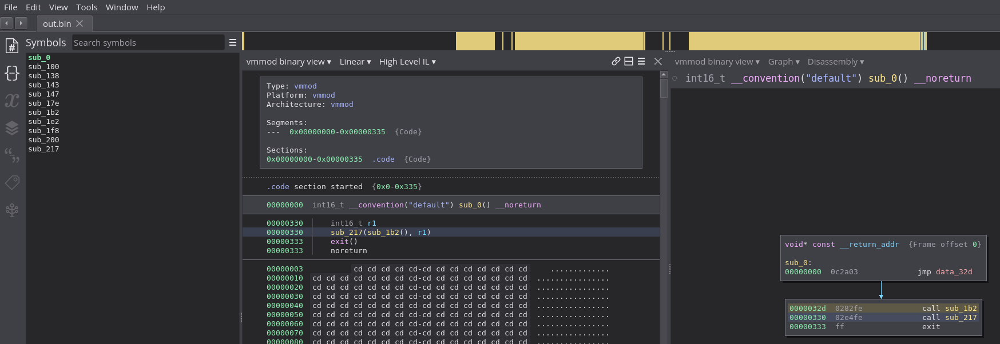
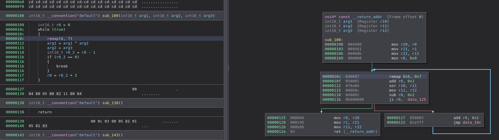
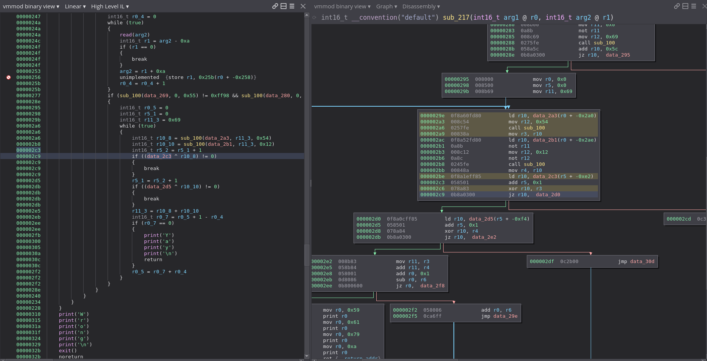

# VMMOD Arch and View Plugin
The last day's challenge for imaginaryCTF was a vm reversing challenge (and a pwn challenge but i never got to it) by TheBadGod

The vm was a custom register-based vm and my plugin does the following
- binaryview loader
- disassemble opcodes
- lift and decompile with calling convention

Some pictures:

